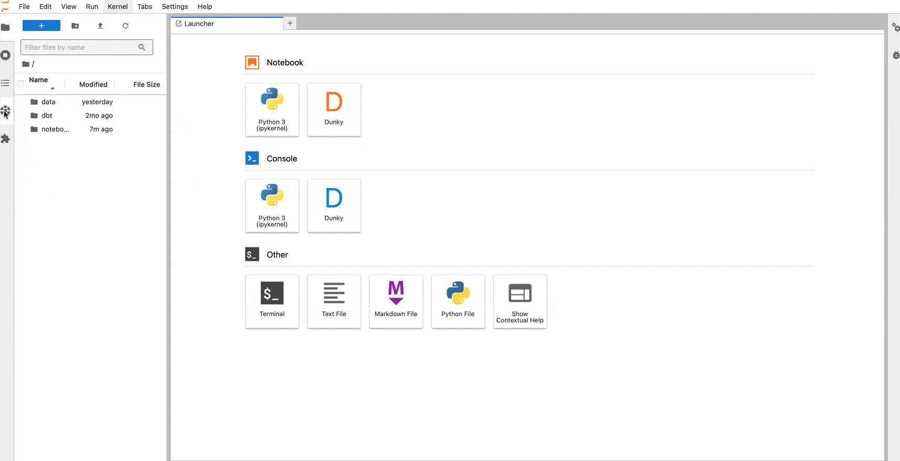

# junity

[](https://github.com/dan1elt0m/junity/actions/workflows/build.yml)

A JupyterLab extension for Unity Catalog



## Requirements

- JupyterLab >= 4.0.0

## Install

To install the extension, execute:

```bash
pip install junity
```

## Uninstall

To remove the extension, execute:

```bash
pip uninstall junity
```

## Configuration

The default `unityCatalogHostUrl` is set to `http://localhost:8080/api/2.1/unity-catalog`.

To adjust the `unityCatalogHostUrl`, follow these steps:

1. Open JupyterLab.
2. Navigate to the settings menu.
3. Find the `Junity` setting.
4. Update the URL to your desired endpoint.
5. Update the token if needed

If you can't see your catalogs being loaded in the Unity Catalog sidebar, make sure that the URL is correct and that the Unity Catalog server is running.
If this is the case, then check Known Issues section below or check for errors in jupyter using a webinspector

## Known Issues

This is more of a general problem with browsers trying to reach localhost services:

- If both Jupyter Labs and Unity Catalog are running on localhost, you may run into CORS issues.
  To resolve this, you can add CORS settings to the Unity Catalog server or set up a reverse proxy (For instance Nginx, or Apache).
  Checkout the docker example to see how to set up a reverse proxy with Nginx.

## Docker Example

In the `docker` folder, you can find an example of how to run JupyterLab and Unity Catalog in Docker containers.
To run the example, execute:

```bash
docker compose up --build -d
```

This will start JupyterLab on `http://localhost:8888` and Unity Catalog on `http://localhost:8080/api/2.1/unity-catalog`.
You can access the example notebook by opening this URL in your browser: `http://localhost:8888/lab?token=junity/tree/example.ipynb`

## Contributing

### Development install

Note: You will need NodeJS to build the extension package.

The `jlpm` command is JupyterLab's pinned version of
[yarn](https://yarnpkg.com/) that is installed with JupyterLab. You may use
`yarn` or `npm` in lieu of `jlpm` below.

```bash
# Clone the repo to your local environment
# Change directory to the junity directory
# Install package in development mode
pip install -e "."
# Link your development version of the extension with JupyterLab
jupyter labextension develop . --overwrite
# Rebuild extension Typescript source after making changes
jlpm build
```

You can watch the source directory and run JupyterLab at the same time in different terminals to watch for changes in the extension's source and automatically rebuild the extension.

```bash
# Watch the source directory in one terminal, automatically rebuilding when needed
jlpm watch
# Run JupyterLab in another terminal
jupyter lab
```

With the watch command running, every saved change will immediately be built locally and available in your running JupyterLab. Refresh JupyterLab to load the change in your browser (you may need to wait several seconds for the extension to be rebuilt).

By default, the `jlpm build` command generates the source maps for this extension to make it easier to debug using the browser dev tools. To also generate source maps for the JupyterLab core extensions, you can run the following command:

```bash
jupyter lab build --minimize=False
```

### Development uninstall

```bash
pip uninstall junity
```

In development mode, you will also need to remove the symlink created by `jupyter labextension develop`
command. To find its location, you can run `jupyter labextension list` to figure out where the `labextensions`
folder is located. Then you can remove the symlink named `junity` within that folder.

### Testing the extension

#### Frontend tests

This extension is using [Jest](https://jestjs.io/) for JavaScript code testing.

To execute them, execute:

```sh
jlpm
jlpm test
```

#### Integration tests

This extension uses [Playwright](https://playwright.dev/docs/intro) for the integration tests (aka user level tests).
More precisely, the JupyterLab helper [Galata](https://github.com/jupyterlab/jupyterlab/tree/master/galata) is used to handle testing the extension in JupyterLab.

More information are provided within the [ui-tests](./ui-tests/README.md) README.

### Packaging the extension

See [RELEASE](RELEASE.md)

#### Remarks

Also checkout my other library [dunky](https://github.com/dan1elt0m/dunky) for a matching jupyter kernel

```

```
